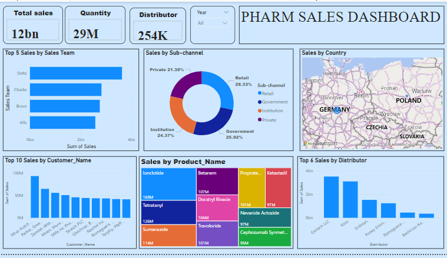

### pharmaceutical_Sales_Analysis

## Introduction

Pharm is a prominent global pharmaceutical manufacturing company with a worldwide presence Its markets are segmented into various regions, including one that oversees the German and Polish markets. Rather than selling directly to customers, the company collaborates with several distributors in each region. These distributors provide sales data as part of an agreement, allowing the
company to gain insights into retail-level performance. 
The sales data is shared  with the company in CSV format.

 ## Problem Statement 

 The Objectives of this analysis are as follows . 

 - Total number of sales 

- Total quantity

- Total number of distributors

- Top 5 Sales by Sales Team 

- Sales by Sub - Channel

- Sales by Country

- Top 10 Sales by Customer Name

- Sales by Product Name

- Top 6 Sales by Distributor

  ## Skills Demostrated

   The following skills are demostrated

  - Excel for data profiling
    
  - Power bi  for data visualization
 
## Data Sourcing 

This datasets is from 3signetltd. it is a csv file . Its has 18 columns and 254082 rows.

## Data Transformation 
The is a clean data with .

## Data modeling 

Relationships were established among these seven tables, using their primary keys. Since each table has a 
primary key, and each primary key is in the sales data table, therefore relationship was created during data
 importation in power bi  with the primary keys.

## Data Analysis and Visualization 

- Total number of sales is 12bn  during the period covered.

- Total quantity is about 29m .

- Total number of distributors 254k.

  . 

- Rusian has the highest suicides rate followed by United state and Japan.

- The age group of 35-54 has the highest suicide rate while the age group of 5-14 has the least suicide rate.

## Conclusions And Recommendations

1. Understand your products inside and out: mechanism of action,
     clinical data, benefits, side effects, and comparisons with competitors.

2. Be prepared to discuss new research, updates, or relevant guidelines to stay 
     credible.

3. Segment your customers: Know which doctors, healthcare professionals (HCPs), 
     and hospitals need your products the most.

4. Apportion incentives: some distributors sales are low, there is need to look into
      and see how to  boost sales in that region

5. Sub channel evaluation: Government institution sales sub-channel should be
  selling more since governmental institutions have larger patients than other outlets. 
  More sales outlets could be set up to bring drugs closers to patients.

